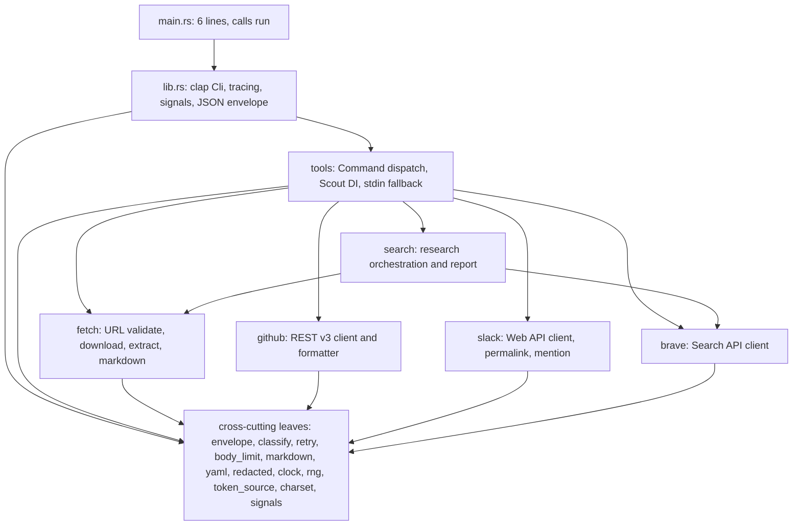
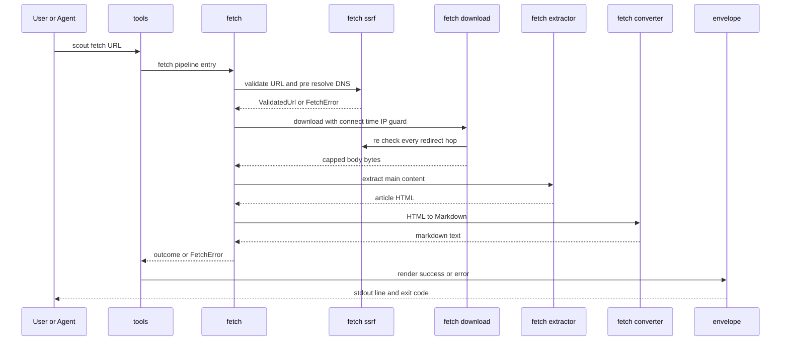
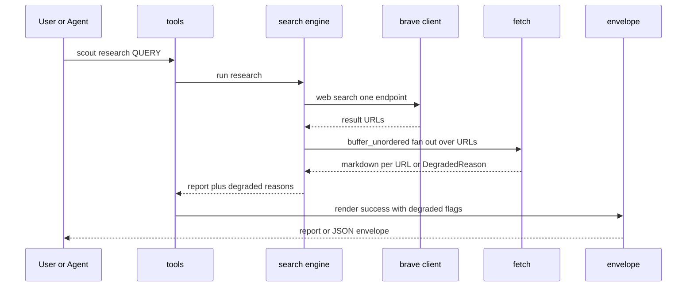
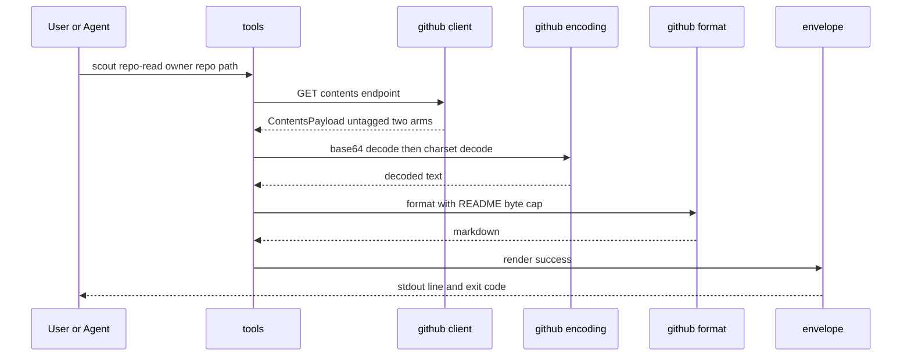
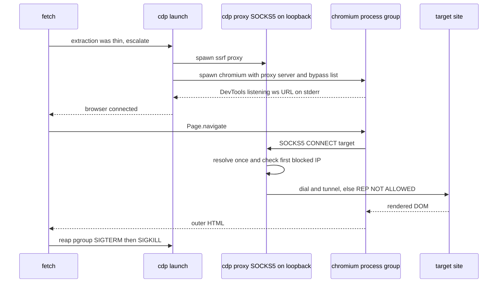

# Architecture — scout

## アーキテクチャスタイル

**単一 crate のレイヤード構成に、trait 注入による test seam を通したもの。** `Cargo.toml` に `[workspace]` セクションは無く、`Cargo.lock` の `[[package]] name = "scout"` は 1 件である。プロセスは 1 本、デプロイ単位も 1 本で、分散要素は一切ない。

レイヤは 4 段で、依存の向きは一方向である。

1. **エントリ** — `src/main.rs` (6 行) が `scout::run()` を呼び `ExitCode` を返す
2. **CLI 表面** — `src/lib.rs` が `clap` の `Cli` を解析し、tracing を初期化し、シグナルと JSON envelope の分岐を持つ
3. **ハンドラ層** — `src/tools.rs` の `Scout` が `Command` の 6 分岐をディスパッチし、バックエンドを保持する
4. **バックエンドと横断リーフ** — `fetch`/`github`/`slack`/`brave`/`search` が外部 I/O を担い、`envelope` 以下のリーフが分類・整形・注入点を担う

**外部への公開 API は `pub async fn run() -> ExitCode` の 1 つだけである。** `Cargo.toml` の `unreachable_pub = "deny"` がこれを機械的に固定する。つまり crate の契約面は Rust API ではなく CLI 表面にあり、詳細は `api-documentation.md` が持つ。

### なぜ hexagonal ではなく DI seam なのか

ドメイン層を framework から隔離する完全な ports and adapters は採られていない。代わりに `src/tools.rs` の `Scout` が 12 フィールドを持ち、`Arc<dyn Trait>` 形式の注入点を必要な場所にだけ開ける。この判断は DR-0008 (Test seam architecture via `Arc<dyn Trait>` fields and `ScoutBuilder`) と DR-0009 (Object-safe `DnsResolver` and `Arc<dyn DnsResolver>` injection via `ScoutBuilder`) に記録されている。注入点は時計 (`src/clock.rs`)、乱数 (`src/rng.rs`)、トークン解決 (`src/token_source.rs`)、DNS 解決の 4 種で、いずれも「テストが実時間・実ネットワーク・実資格情報を待たない」ために開かれている。

GitHub と Slack のクライアントは `OnceCell` で遅延初期化される。トークンを必要としないサブコマンドがトークン解決を走らせないためである。

## コンポーネント関係

<!-- Text fallback: main.rs calls lib.rs; lib.rs drives tools and the cross-cutting leaves; tools dispatches to fetch, github, slack, brave, and search; search calls brave and fetch; every backend depends on the cross-cutting leaves; no leaf imports a backend. -->

**循環は無い。** `src/tools.rs` は `brave::client`/`clock`/`envelope`/`fetch`/`github`/`markdown`/`rng`/`slack`/`token_source`/`yaml` を直接 import し、逆向きの import を持たない。横断リーフ側からバックエンドへの import も無い。この一方向性の測定範囲は `src/tools.rs` と `src/fetch.rs` の `use crate::…` を読んだ範囲に限る (`reverse-engineering-timestamp.md` の `analyzed.paths` 参照)。

コンポーネントごとの責務と依存は `component-inventory.md` が持つ。

## Interaction Diagrams

業務トランザクションがコンポーネントをどう横断するかを 4 本の経路で示す。

### fetch — 単一 URL の取得

SSRF 防御が経路の骨格そのものになっている。検証は 1 回ではなく、redirect のホップごとに繰り返される。

<!-- Text fallback: tools hands the URL to fetch; fetch validates it and pre-resolves DNS through the ssrf module; download applies the connect-time IP guard and re-checks every redirect hop; the body is read under a size cap, extracted by the readability layer, converted to Markdown, and rendered by envelope into a stdout line plus an exit code. -->

判定の閾値は `src/fetch.rs` の `is_js_dependent`/`has_thin_body`/`is_thin_extract` の 3 つが持ち、抽出が薄いときに `js-rendering` 経路へ落ちる契機になる。エラーは `FetchError` の 14 variant で表され、`classify()` のアーム順が終了コードへの写像を決める (DR-0003, DR-0011)。

### research — 検索と並列取得の合成

<!-- Text fallback: research asks brave for result URLs, then fans out over them with futures buffer_unordered calling the same fetch pipeline; per-URL failures come back as DegradedReason values rather than aborting the run, and envelope reports them in the degraded_reasons array. -->

**部分失敗が正常系である。** 1 本の URL が落ちても run 全体は成功として返り、落ちた理由が `degraded_reasons` に載る。これが `DegradedReason` 14 variant の存在理由で、DR-0003 に記録されている。並列度は `futures` の `stream::buffer_unordered` が持つ。

### repo-read — GitHub 単一ファイルの復号

<!-- Text fallback: repo-read calls the GitHub contents endpoint; the untagged ContentsPayload distinguishes a file from a directory; the body is base64-decoded then charset-decoded, formatted under the README byte cap, and rendered through envelope. -->

`ContentsPayload` の `untagged` 2 arm は `src/github/types.rs` にあり、ディレクトリ側を `Vec<IgnoredAny>` にした理由がコメントに残る — 素の `IgnoredAny` にすると、エラーオブジェクトも文字列も `null` も同じアームへ落ち、caller が全部 `PathIsDirectory` に潰した。出力スキーマと README のバイト上限は DR-0016 が定める。

### js-rendering — CDP 経路と SOCKS5 proxy

`js-rendering` feature が有効なときだけコンパイルされる経路である。既定は無効。

<!-- Text fallback: when extraction is thin, fetch launches a loopback SOCKS5 proxy and a chromium process group pointed at it; the proxy resolves the CONNECT target once and fails closed if any resolved address is private; the rendered DOM returns over CDP and the process group is reaped with SIGTERM followed by SIGKILL. -->

この経路が SSRF 防御に穴を開けない仕組みは 3 つのフラグに載っている。`src/fetch/cdp/launch.rs` の `build_launch_args` が返す 12 フラグのうち `--proxy-server=socks5://127.0.0.1:{port}`/`--proxy-bypass-list=<-loopback>`/`--disable-quic` の 3 つに DR-0021 を引く根拠コメントが付く。`--proxy-bypass-list` は chromium の implicit bypass (loopback と 169.254/16 の IMDS) を subtract する。`src/fetch/cdp/proxy.rs` の `handle_conn` は CONNECT target を 1 回だけ解決し、`first_blocked_ip` が private を 1 つでも返せば `REP_NOT_ALLOWED` で fail-closed する。

## データフローの共通形

4 経路すべてが同じ 3 段を通る。

| 段                   | 担当                                                                    | 決めていること                                                                                                            |
| -------------------- | ----------------------------------------------------------------------- | ------------------------------------------------------------------------------------------------------------------------- |
| 入力の検証           | `fetch/ssrf.rs`、`github/helpers.rs`、`slack/url.rs`、`brave/client.rs` | 外部へ出る前に宛先を型で確定させる。`ValidatedUrl` がこの型                                                               |
| 実行とリトライ       | `src/retry.rs`、各クライアント                                          | `Retry-After` の解釈を 1 箇所へ集約する (DR-0006)。バックオフのジッタは `Rng` trait 経由                                  |
| 出力の中和と封筒詰め | `src/markdown.rs`、`src/yaml.rs`、`src/envelope.rs`、`src/classify.rs`  | エージェント向けの注入防御 (DR-0014) を通し、成功/失敗を envelope と終了コードへ写す (DR-0002, DR-0003, DR-0010, DR-0017) |

秘密はこの流れの外側にある。`src/redacted.rs` の `Redacted` 型が保持し、`Display` を通さないことで出力経路へ落ちない (DR-0015)。

## 主要な設計判断 (DR 索引)

決定の本文・却下した選択肢・帰結は `docs/decisions/` にある。ここは「どの関心がどの DR に決まっているか」だけを持つ。索引表は `docs/decisions/README.md`。

| 関心                                                      | DR               |
| --------------------------------------------------------- | ---------------- |
| SSRF 防御の構造と `fetch.rs` のモジュール分割             | 0001             |
| 終了コード体系 (sysexits.h + coreutils + POSIX 128+signo) | 0002, 0017       |
| エラー分類の契約と優先順位                                | 0003, 0011       |
| GitHub クライアントの振る舞い上限と出力スキーマ           | 0004, 0016       |
| 検索バックエンドの選択と初期化                            | 0005, 0007, 0020 |
| リトライ遅延の集約                                        | 0006             |
| test seam (trait 注入と `ScoutBuilder`)                   | 0008, 0009       |
| JSON envelope の契約                                      | 0010             |
| DNS rebinding に対する connect 時 IP guard                | 0012             |
| 文字コード判定とデコード方針                              | 0013             |
| エージェント向け出力注入防御                              | 0014             |
| 秘密の型封じ込め                                          | 0015             |
| トークン解決の優先順位と漏洩封じ込め                      | 0018             |
| 環境変数の検証とタイムアウト階層                          | 0019             |
| CDP chromium の起動 egress フラグ                         | 0021             |
| Slack user token の prefix 検証                           | 0022             |
| proxy 経由経路での防御委譲                                | 0023             |
| 外部前提ごとのテスト skip                                 | 0024             |
| `<pre>` / ` ` と改行の扱い                             | 0025, 0026, 0027 |
| DR からコードを指す参照の形                               | 0028             |

**DR-0012 のタイトルは `with CDP Path Asymmetry` で終わるが、その非対称は現在解消済みである。** 同 DR の Addendum (issue #201、2026-06-16 close) が loopback SOCKS5 proxy 方式で穴を塞いだことを記録し、OUTCOME Constraint の carve-out 文言も置換済みである。DR 本文の Consequences 箇条書きは MADR の慣行どおり決定時点の帰結を残しているだけで、未解決の課題ではない。

## 改善余地

構造上の負債は 1 点に集中している。詳細と現状の判断は `code-quality-assessment.md` が持つ。

- **`src/fetch/converter.rs` が 3,131 行** — 実装 985 行と `#[cfg(test)] mod tests` 2,146 行。このリポジトリ自身の「1 ファイルのテストが 2 つ以上の関心を持ったら分ける」規約から外れる唯一の実装ファイルである。**テスト 79 本が分かれる関心は 6 つではなく 9 つで、ファイル順では 26 の連続区間に散っている** (先行資料の「6 群」を上書きした。内訳は `code-structure.md` の `## サイズ分布`)。切り出す単位の判断は依然として未着手だが、判断に要る材料は揃っている — そのまま出せる連続区間が 3 つ、並べ替えが要る関心が 2 つ、テストだけを割る場合と実装まで割る場合のコスト差が `code-quality-assessment.md` の `### E-4` にある
- **`with_clock` / `with_rng` が 4 クライアントに同形で並ぶ** — `github.rs`/`brave/client.rs`/`slack/client.rs`/`tools/builder.rs`。共通化は実測のうえ棄却済みで、再検討の着手条件が closed issue #310 の Backlog candidates の中にしか無い

いずれも「知らないまま放置している」のではなく「測って現状維持を選んだ」判断であり、再検討の閾値が文書に残っている。

**構造上の負債として数えていた項目が 2 つ減った。** 監査文書 E-1 (`src/tools/config.rs` の `surface_overrides`) と E-3 (`src/slack/client.rs` の `api_get_once`) は、attempt 2 が該当ファイルを開いて決着させ、どちらも現状維持が正しいことを実測で裏付けた。E-3 の棄却理由は監査文書の論拠より強いものがコードにある — 畳めば失うのは `SlackError::Api` の 6 分岐と retry である (`code-quality-assessment.md` の `### E-1` と `### E-3`)。
